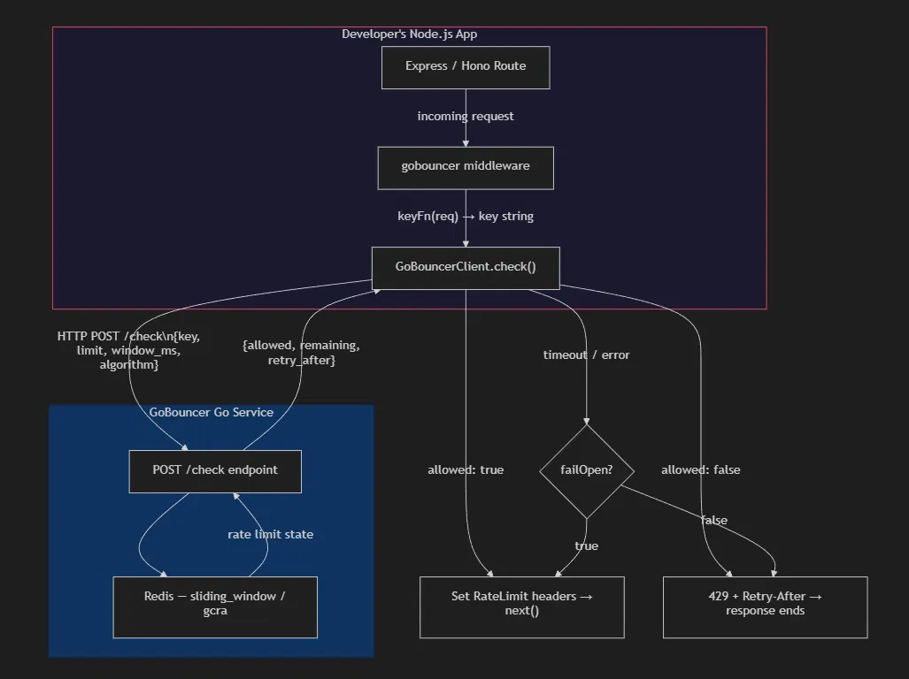

# gobouncer

Drop-in rate limiting middleware for Node.js, backed by the [GoBouncer](https://github.com/ritik-kharya/gobouncer) Go service.

GoBouncer itself runs as a small, fast Go service backed by Redis. This package is a thin client — it does no rate limiting math itself, it just talks to your running GoBouncer instance over HTTP and gives you an Express-style middleware.

## Install

Node.js:

```bash
npm install gobouncer
```

Requires Node.js 18+ (uses the built-in `fetch`).

Python:

```bash
pip install -e .
```

After the Python package is published to PyPI:

```bash
pip install gobouncer
```

## Quick start

Most apps should define rate-limit policies once and reuse them by name in routes.

```js
// policies.js
// you can write custom configuration with your requirement
module.exports = {
  profileRead: {
    algorithm: 'gcra',
    limit: 100,
    windowMs: 60_000,
  },
  otpVerify: {
    algorithm: 'sliding-window',
    limit: 5,
    windowMs: 60_000,
  },
  paymentCreate: {
    algorithm: 'gcra',
    limit: 3,
    windowMs: 60_000,
  },
}
```

```js
// limiter.js
const { gobouncer } = require('gobouncer')
const policies = require('./policies')

const limiter = gobouncer({
  url: process.env.GOBOUNCER_URL ?? 'http://localhost:8080',
  timeoutMs: 150,
  failOpen: true,
  apiKey: process.env.GOBOUNCER_API_KEY,
  policies,
})

module.exports = { limiter }
```

```js
// routes.js
const express = require('express')
const { limiter } = require('./limiter')

const app = express()

app.set('trust proxy', true)
app.use(express.json())

app.get('/profile', limiter.use('profileRead'), profileHandler)
app.post('/verify-number', limiter.use('otpVerify'), verifyNumberHandler)
app.post('/payment', limiter.use('paymentCreate'), paymentHandler)

app.listen(3000)
```

`limiter.use('profileRead')` returns middleware. When the request is allowed, it calls `next()` and your handler runs. When the request is over the limit, it returns `429 Too Many Requests` and your handler does not run.

For local policies, keys are automatically namespaced before they are sent to GoBouncer:

```text
ratelimit:{policyName}:{algorithm}:{key}
```

So these two routes do not collide in Redis even if both key on `user:42`:

```js
app.get('/profile', limiter.use('profileRead', {
  key: () => 'user:42',
}), profileHandler)

app.post('/verify-number', limiter.use('otpVerify', {
  key: () => 'user:42',
}), verifyNumberHandler)
```

They become separate rate-limit keys:

```text
ratelimit:profileRead:gcra:user:42
ratelimit:otpVerify:sliding_window:user:42
```

You can also pass a custom key for authenticated routes:

```js
app.get(
  '/dashboard',
  limiter.use('profileRead', {
    key: (req) => `user:${req.user.id}`,
  }),
  dashboardHandler
)
```

If you keep policies inside the GoBouncer service instead of `policies.js`, use the same route style. When a policy name is not found in the local `policies` object, `limiter.use(name)` sends the name to GoBouncer as a server-side policy.

```js
app.post('/login', limiter.use('login'), loginHandler)
```

### Inline Express Example

```ts
import express from 'express'
import { gobouncer } from 'gobouncer'

const app = express()

// Create once, reuse everywhere
const limiter = gobouncer({ url: 'http://localhost:8080' })

// Apply globally — 100 requests per minute per IP
app.use(limiter.limit({ max: 100, windowMs: 60_000 }))

// Stricter limit on a sensitive route using a named GoBouncer policy
app.post('/login', limiter.policy({ name: 'login' }), loginHandler)

// Limit by authenticated user instead of IP
app.post(
  '/api/ai/generate',
  limiter.policy({
    name: 'user-free',
    key: (req) => `user:${req.user.id}`,
  }),
  generateHandler
)

app.listen(3000)
```

## Basic image support for overview 


## API Reference

Generated API docs live in [`docs/api`](docs/api/index.html). Regenerate them with:

```bash
npm run docs
```

Python users can install the Python package from this repo with `pip install -e .`; after PyPI publishing, this becomes `pip install gobouncer`. See the Python backend guide in [`docs/python.md`](docs/python.md) for FastAPI, Flask, and Django examples.

## Maintainer Workflow

Before publishing, verify the package contents:

```bash
npm run pack:check
```

Releases use Changesets:

```bash
npm run changeset
npm run version
npm run release
```

On `main`, the release workflow opens a version PR when changesets exist. After that PR is merged, it publishes to npm and creates the GitHub release.

Python package builds use:

```bash
python -m build --outdir python-dist
```

The `python-release` workflow can be run manually to publish the Python package to PyPI after PyPI trusted publishing is configured.

## API

### `gobouncer(options)`

Creates a client.

| Option      | Type      | Default          | Description                                            |
| ----------- | --------- | ---------------- | -------------------------------------------------------- |
| `url`       | `string`  | —                | Base URL of your running GoBouncer service              |
| `timeoutMs` | `number`  | `150`            | Max time to wait for a response                          |
| `failOpen`  | `boolean` | `true`           | Allow requests through if GoBouncer is unreachable        |
| `apiKey`    | `string`  | —                | Optional shared secret sent as `X-GoBouncer-Key`         |
| `onError`   | `function` | —               | Optional `(err: Error) => void` triggered on failures    |

### `limiter.limit(options)`

Returns an Express-style middleware `(req, res, next) => void`.

| Option      | Type                  | Default            | Description                                  |
| ----------- | --------------------- | ------------------- | --------------------------------------------- |
| `max`       | `number`              | —                    | Max requests allowed per window               |
| `windowMs`  | `number`              | —                    | Window size in milliseconds                   |
| `key`       | `(req) => string`     | limits by client IP | How to identify the caller                    |
| `algorithm` | `'sliding_window'` \| `'gcra'` | `'sliding_window'`  | Which algorithm GoBouncer should use          |

The middleware automatically sets standard rate-limiting headers on every response:
- `X-RateLimit-Limit`: The `max` limit configured.
- `X-RateLimit-Remaining`: How many requests are left in the current window.
- `X-RateLimit-Reset`: Unix timestamp in seconds indicating when the window resets (when `retry_after` info is available).

If the limit is exceeded, it intercepts the request, sets a `Retry-After` header (in seconds), and returns a `429 Too Many Requests` status with a JSON body:
```json
{
  "error": "too many requests",
  "retry_after_ms": 5000
}
```

### `limiter.ping()`

Checks connection to the GoBouncer service. Sends a request to `/health` (falling back to `/`) and returns a `Promise<boolean>` indicating whether the service is reachable.

```ts
const isOnline = await limiter.ping()
if (!isOnline) {
  console.warn("GoBouncer service is offline!")
}
```

### `limiter.check(key, max, windowMs, algorithm?)`

Call GoBouncer directly without the middleware wrapper — useful for protecting non-HTTP code paths, like before enqueuing a BullMQ job:

```ts
const result = await limiter.check(`enqueue:${userId}`, 10, 60_000)
if (!result.allowed) {
  throw new Error(`queue limit reached, retry in ${result.retry_after}ms`)
}
await emailQueue.add('send', jobData)
```

### `limiter.checkPolicy(key, policy)`

Call GoBouncer directly with a named policy configured in the GoBouncer service:

```ts
const result = await limiter.checkPolicy(`user:${userId}`, 'login')
if (!result.allowed) {
  throw new Error(`login limit reached, retry in ${result.retry_after}ms`)
}
```

### `limiter.policy(options)`

Returns an Express-style middleware using a named GoBouncer policy.

```ts
app.post('/otp', limiter.policy({
  name: 'login',
  key: (req) => `otp:${req.ip}:${req.body.phone}`,
}), otpHandler)

app.post('/login', limiter.policy({
  name: 'login-route',
  key: (req) => `route:/login:ip:${req.ip}`,
}), loginHandler)
```

| Option | Type | Default | Description |
| ------ | ---- | ------- | ----------- |
| `name` | `string` | - | Named GoBouncer policy, such as `login`, `login-route`, `public-api`, or `user-free` |
| `key` | `(req) => string` | limits by client IP | How to identify the caller |

### `limiter.use(name, options?)`

Returns Express middleware for a reusable application policy.

```js
const limiter = gobouncer({
  url: 'http://localhost:8080',
  policies: {
    profileRead: { algorithm: 'gcra', limit: 100, windowMs: 60_000 },
    otpVerify: { algorithm: 'sliding-window', limit: 5, windowMs: 60_000 },
  },
})

app.get('/profile', limiter.use('profileRead'), profileHandler)
app.post('/verify-number', limiter.use('otpVerify'), verifyNumberHandler)
```

If `name` exists in `policies`, GoBouncer receives an inline check using that policy's `limit`, `windowMs`, and `algorithm`.

If `name` does not exist in `policies`, GoBouncer receives a named policy check:

```js
app.post('/login', limiter.use('login'), loginHandler)
```

For server-side policies, the GoBouncer service should namespace Redis keys after resolving the policy:

```text
ratelimit:{policyName}:{algorithm}:{key}
```

That keeps policies like `profileRead` and `otpVerify` isolated even when both use the same logical key, such as `user:42`.

| Option | Type | Default | Description |
| ------ | ---- | ------- | ----------- |
| `key` | `(req) => string` | limits by client IP | How to identify the caller |

### Built-in key helpers

```ts
import { ipKey, headerKey } from 'gobouncer'

limiter.limit({ max: 100, windowMs: 60_000, key: ipKey })
limiter.limit({ max: 100, windowMs: 60_000, key: headerKey('X-API-Key') })
```

## Behaviour when GoBouncer is unreachable

By default (`failOpen: true`), requests pass through if GoBouncer can't be reached within `timeoutMs`. This means a GoBouncer outage degrades your app to "no rate limiting" instead of "app is down." Set `failOpen: false` if strict enforcement matters more than availability for your use case.

---

## Hono.js

The package ships a dedicated Hono adapter via the `gobouncer/hono` sub-path export. No extra dependencies — Hono is an optional peer dependency.

### Quick start (Hono)

```ts
import { Hono } from 'hono'
import { gobouncer } from 'gobouncer'
import { honoLimit, honoPolicy } from 'gobouncer/hono'

const app = new Hono()

const limiter = gobouncer({ url: 'http://localhost:8080' })

// Global — 100 requests per minute per IP
app.use('*', honoLimit(limiter, { max: 100, windowMs: 60_000 }))

// Stricter limit on a sensitive route using a named policy
app.post('/login', honoPolicy(limiter, { name: 'login' }), loginHandler)

// Limit by a custom header
import { honoHeaderKey } from 'gobouncer/hono'

app.use(
  '/api/*',
  honoLimit(limiter, {
    max: 50,
    windowMs: 60_000,
    key: honoHeaderKey('X-API-Key'),
  })
)

// Limit by authenticated user
app.post(
  '/api/ai/generate',
  honoPolicy(limiter, {
    name: 'user-free',
    key: (c) => `user:${c.req.header('x-user-id') ?? 'anon'}`,
  }),
  generateHandler
)

export default app
```

### `honoLimit(client, options)`

Returns a Hono-compatible middleware `MiddlewareHandler`.

| Option      | Type                  | Default            | Description                                  |
| ----------- | --------------------- | ------------------- | --------------------------------------------- |
| `max`       | `number`              | —                    | Max requests allowed per window               |
| `windowMs`  | `number`              | —                    | Window size in milliseconds                   |
| `key`       | `(c: Context) => string` | limits by client IP | How to identify the caller                |
| `algorithm` | `'sliding_window'` \| `'gcra'` | `'sliding_window'`  | Which algorithm GoBouncer should use  |

### `honoPolicy(client, options)`

Returns a Hono-compatible middleware using a named GoBouncer policy.

```ts
app.post('/otp', honoPolicy(limiter, {
  name: 'login',
  key: (c) => `otp:${c.req.header('x-forwarded-for') ?? 'unknown'}`,
}), otpHandler)
```

| Option | Type | Default | Description |
| ------ | ---- | ------- | ----------- |
| `name` | `string` | - | Named GoBouncer policy |
| `key` | `(c: Context) => string` | limits by client IP | How to identify the caller |

### Hono key helpers

```ts
import { honoIpKey, honoHeaderKey } from 'gobouncer/hono'

honoLimit(limiter, { max: 100, windowMs: 60_000, key: honoIpKey })
honoLimit(limiter, { max: 100, windowMs: 60_000, key: honoHeaderKey('X-API-Key') })
```

- **`honoIpKey(c)`** — reads `x-forwarded-for` → `x-real-ip` → `'unknown'`
- **`honoHeaderKey(headerName)`** — reads the given header, falls back to `honoIpKey`

---

## Backend Boilerplates

The pattern is the same in every backend framework:

1. Run the GoBouncer service.
2. Create one `limiter` client when your app starts.
3. Attach middleware before the route handler.
4. If allowed, the route handler runs. If denied, GoBouncer middleware returns `429`.

### Express

```js
const express = require('express')
const { gobouncer } = require('gobouncer')

const app = express()
const limiter = gobouncer({
  url: process.env.GOBOUNCER_URL ?? 'http://localhost:8080',
  policies: {
    profileRead: { algorithm: 'gcra', limit: 100, windowMs: 60_000 },
    otpVerify: { algorithm: 'sliding-window', limit: 5, windowMs: 60_000 },
  },
})

app.get('/profile', limiter.use('profileRead'), handler)
app.post('/verify-number', limiter.use('otpVerify'), handler)
```

### Hono

```ts
import { Hono } from 'hono'
import { gobouncer } from 'gobouncer'
import { honoLimit, honoPolicy } from 'gobouncer/hono'

const app = new Hono()
const limiter = gobouncer({ url: 'http://localhost:8080' })

app.get('/profile', honoPolicy(limiter, { name: 'profileRead' }), handler)
app.post('/verify-number', honoPolicy(limiter, { name: 'otpVerify' }), handler)
app.use('/api/*', honoLimit(limiter, { max: 100, windowMs: 60_000 }))
```

### Fastify

```ts
import Fastify from 'fastify'
import { gobouncer } from 'gobouncer'
import { fastifyLimit } from 'gobouncer/fastify'

const fastify = Fastify()
const limiter = gobouncer({ url: 'http://localhost:8080' })

fastify.get('/profile', {
  preHandler: fastifyLimit(limiter, { max: 100, windowMs: 60_000 }),
}, handler)
```

### Koa

```ts
import Koa from 'koa'
import { gobouncer } from 'gobouncer'
import { koaLimit } from 'gobouncer/koa'

const app = new Koa()
const limiter = gobouncer({ url: 'http://localhost:8080' })

app.use(koaLimit(limiter, { max: 100, windowMs: 60_000 }))
```

### Next.js / Edge

```ts
import { NextResponse } from 'next/server'
import { gobouncer } from 'gobouncer'
import { nextLimit } from 'gobouncer/next'

const limiter = gobouncer({ url: process.env.GOBOUNCER_URL! })
const limit = nextLimit(limiter, { max: 100, windowMs: 60_000 })

export async function middleware(req: Request) {
  const blocked = await limit(req)
  if (blocked) return blocked
  return NextResponse.next()
}
```

### Elysia

```ts
import { Elysia } from 'elysia'
import { gobouncer } from 'gobouncer'
import { elysiaLimit } from 'gobouncer/elysia'

const limiter = gobouncer({ url: 'http://localhost:8080' })

new Elysia().get('/profile', handler, {
  beforeHandle: elysiaLimit(limiter, { max: 100, windowMs: 60_000 }),
})
```

---

## Fastify

```ts
import { fastifyLimit } from 'gobouncer/fastify'

fastify.get('/api', {
  preHandler: fastifyLimit(limiter, { max: 100, windowMs: 60_000 })
}, handler)
```

## Koa

```ts
import { koaLimit } from 'gobouncer/koa'

app.use(koaLimit(limiter, { max: 100, windowMs: 60_000 }))
```

## Next.js / Edge middleware

Returns a blocked response (429) if the limit is exceeded, or `null` if allowed.

```ts
import { nextLimit } from 'gobouncer/next'

const limit = nextLimit(limiter, { max: 100, windowMs: 60_000 })

export async function middleware(req: Request) {
  const blockedResponse = await limit(req)
  if (blockedResponse) return blockedResponse
  return NextResponse.next()
}
```

## Elysia

```ts
import { elysiaLimit } from 'gobouncer/elysia'

new Elysia().get('/api', () => 'hi', {
  beforeHandle: elysiaLimit(limiter, { max: 100, windowMs: 60_000 })
})
```

---

## License

MIT
